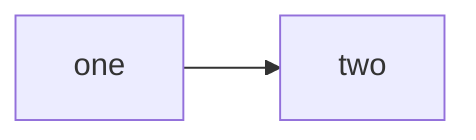

# BUGS.md — open defects

A log of confirmed defects, newest first. One entry per defect.

Each entry carries: **symptom**, **minimal reproduction**, **expected vs
actual**, **where the failure was localised**, and — separately — what was
*observed* versus what was *inferred from reading source*. Do not collapse
those two: a mechanism read out of code is a hypothesis until it is executed.

Close an entry by deleting it once the fix is committed. The commit message
carries the record, including what was measured before and after.

---

## The installed tool still binds every interface, and no version string says whether yours does

**Version:** oku 0.6.5, `src 8cd13843bf28`, installed 2026-08-22 11:53.

**Symptom.** `oku serve` listens on `*:PORT` rather than on loopback, and it
hands out the **project root** — the working copy, not a built doc tree. On a
repository with a `personal/`, a `config/secrets.json` and a `.git/`, running
the preview publishes all three to everyone on the network. The line printed
underneath says `http://localhost:9876`, so the one place a reader would check
says the opposite of what happened.

The code defect is already fixed. `f785d1d` (2026-08-22 16:38) makes the bind
`("host", port)` with a `127.0.0.1` default and adds `src/oku_tests/
test_serve_bind.py`. **What is still open is that a build made before it cannot
be told apart from one made after it.**

**Minimal reproduction.** Any project with a docs directory. Nothing is written.

```
cd ~/dev/mmdemirbas/html-doc/docs
oku serve --no-watch --no-search &
lsof -nP -iTCP -sTCP:LISTEN | grep 9876
pkill -f "oku serve"
```

**Expected.** `TCP 127.0.0.1:9876 (LISTEN)` — reachable from this machine only,
which is what the printed URL claims.

**Actual.**

```
python3.1  9383  md  3u  IPv4  0xc3ca47f52785b0ea  0t0  TCP *:9876 (LISTEN)
```

Opening `http://127.0.0.1:9876/` returns a directory listing of the project
root: `.git/`, `config/`, `personal/`, `catalog.db`, `node_modules/`.

**Where the failure was localised.** In the INSTALLED package, not the source:

- `~/.local/share/uv/tools/oku/lib/python3.13/site-packages/oku/cli.py:5811`
  — `http.server.ThreadingHTTPServer(("", port), handler_cls)`
- `src/oku/cli.py:6220-6225` in this repo — `host = getattr(args, "host",
  "127.0.0.1") or "127.0.0.1"`, then `ThreadingHTTPServer((host, port), ...)`

Both report `version = "0.6.5"`; `pyproject.toml` carried 0.6.5 at `f785d1d`
and carries 0.6.5 now, so the package version did not move across a fix that
changes who can reach the server.

**Observed versus inferred.**

*Observed, by running it:* the wildcard bind on a freshly started `oku serve`;
the directory listing of the project root over HTTP; the two `cli.py` lines
above, read in both trees; `f785d1d` being an ancestor of `HEAD`; the installed
`dist-info` timestamp of 11:53 preceding the 16:38 fix; `git cat-file -t
8cd13843bf28` answering `Not a valid object name`.

*Inferred from reading source, not executed:* that `config/secrets.json`
specifically would be served. The handler has no exclusion list and the
directory holding it was listed, so it follows — but no request was made for
that file.

**Suggested fix.** The bind is done. What remains is identity: make
`_tool_digest()` resolvable, or put the commit in the version line, so
`oku --version` can answer "does this build have the loopback default?". Until
then a reader has to grep `site-packages`. A release with a bumped version
number would also do it, and is the smaller change.

---
## An accent token the front-matter spec documents kills every diagram on the page

**Version:** oku 0.6.5, kit 2026-08-20-r46.

**Symptom.** A page with `accent: rose` renders no Mermaid diagram at all. Each
one is replaced by the "Diagram source (failed to render)" card carrying
`Unsupported color format: "rose"`. The page otherwise looks healthy: `oku check
--strict` reports it clean, `oku build` succeeds, every other block renders, and
the accent-coloured chrome is a plausible indigo, so nothing points at the
accent.

**Minimal reproduction.** Two pages differing only in the accent token, one
trivial diagram each.

````markdown
---
title: Rose accent
accent: rose
summary: Minimal reproduction.
---

## One diagram {#d}


````

Build, serve, and read the resolved custom properties plus the diagram host:

```js
const cs = getComputedStyle(document.documentElement);
({ accent: cs.getPropertyValue('--accent').trim(),
   soft:   cs.getPropertyValue('--accent-soft').trim(),
   err:    document.querySelector('.okd-error-card')?.innerText.split('\n')[1],
   w:      Math.round(document.querySelector('.okd-render svg')
             ?.getBoundingClientRect().width ?? 0) })
```

**Expected vs actual.**

| | `accent: teal` (control) | `accent: rose` |
|---|---|---|
| `--accent` | `#0f766e` | `rose` |
| `--accent-soft` | `#ccfbf1` | `#e0e7ff` |
| `--accent-strong` | `#115e59` | `#4338ca` |
| diagram | renders, 155px | error card, 0px |

`rose` is documented. `oku spec front-matter` lists the accent tokens as
"teal/amber/indigo/rose/violet/green/slate".

**Where the failure was localised.** `renderer.js`, `_applyAccent`. The palette
map holds three entries — `teal`, `amber`, `indigo`. Anything else falls through
to `deriveAccent(accent)`, which returns null for a non-hex string, and the
fallback then writes the raw token: `':root { --accent: ' + accent + '; }'`.
`rose` is not a CSS named colour, so the declaration is invalid, the computed
value stays the literal `rose`, and `chrome.js::buildConfig` hands that literal
to Mermaid's `themeVariables` — Mermaid requires a concrete colour and throws.

**Blast radius.** Four of the seven documented tokens are missing from the map.
They split by whether the token happens to be a CSS named colour:

| Token | In the palette map | Valid CSS colour | Result |
|---|---|---|---|
| `teal`, `amber`, `indigo` | yes | — | correct, light and dark |
| `violet`, `green` | no | yes | one hue on `--accent`, indigo on `--accent-soft` / `--accent-strong`, no dark variant. Diagrams survive. |
| `rose`, `slate` | no | no | `--accent` invalid; **every diagram on the page fails** |

The mismatched-hue half is already described in the comment above the fallback
in `_applyAccent`; what that comment does not cover is that an unresolvable
token reaches Mermaid and takes the diagrams with it.

**Observed.** Everything in the two tables above, measured on the reproduction
at kit `2026-08-20-r46`: the resolved custom properties, the error text, the
diagram widths, and the same failure first seen on a real 11-figure page where
it cost one diagram.

**Inferred from reading source.** That `violet` and `green` render a diagram
correctly while carrying a mismatched soft/strong pair. The mechanism is the
same fallback branch and CSS accepts both names, but only `rose` was executed.

**Suggested fix, in order of cost.** Extend the palette map to the seven
documented tokens, which is the only option that also gives them dark variants.
Failing that, validate the token at build time so `oku check` names it instead
of a browser swallowing it. At minimum, make the fallback refuse a string that
is neither a hex nor a recognised CSS colour, rather than writing it into
`--accent` where the next consumer has to cope.


---

No other open defects. The three that were here — a page-adjacent image reaching neither dist output,
an HTML island cut at its first blank line, and code in an island that could
not both render and copy — are fixed in kit `2026-08-20-r44`. Each reproduction
now runs green as a test: `test_build_carries_assets.py`,
`browser/test_image_delivery.py`, and
`browser/test_html_island_spans_blank_lines.py`.

One thing recorded here was NOT a defect. A page named `index.md` in a tree
whose `index.html` came from `oku init` builds correctly, in either order —
`oku build` carries the page body into `dist/standalone/index.html` and
`dist/site/index.json` both times, measured on r44. The trap was in reading
the artifact, not in writing it.
