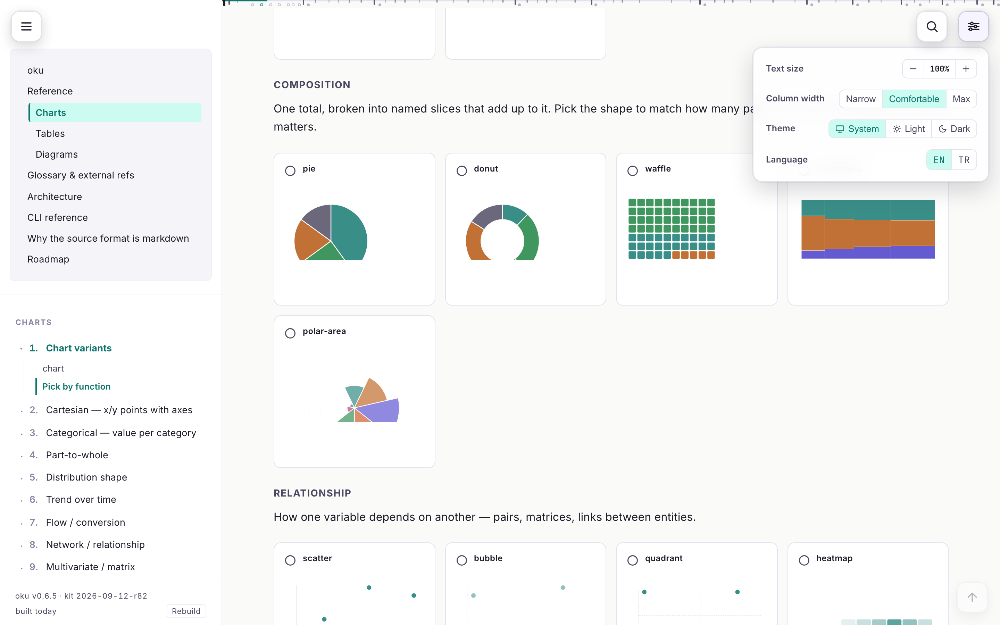
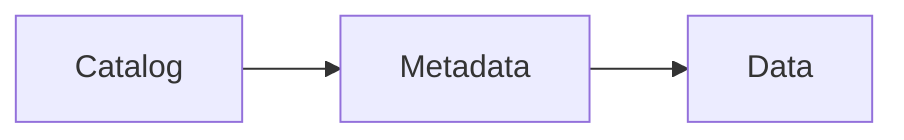

# oku

**Markdown in, self-contained visual HTML out.** Charts, tables, diagrams
and step flows are typed fences in an ordinary Markdown file. The browser
renders them with Custom Elements; one command builds a multi-page site
with search, and a single-file copy of every page that opens from
`file://`.

*oku* is the Turkish imperative: "read!".

<picture>
  <source media="(prefers-color-scheme: dark)" srcset=".github/assets/readme-dark.png">
  
</picture>

## Why

- **The reader gets one file.** It opens from a mail attachment, follows
  the OS theme, and ships Mermaid, Prism and its fonts beside the output
  instead of loading them from a CDN.
- **The author writes Markdown.** GitHub, Obsidian and VS Code still
  render the prose, the tables and the Mermaid; an `oku-*` fence shows
  there as readable JSON.
- **The checks catch what a reviewer would.** Schema, structure and
  presentation rules run in `oku check`, and the build refuses a page
  that fails them.

## Quick start

```bash
git clone git@github.com:mmdemirbas/oku.git && cd oku
./ctl deploy                     # `oku` on PATH; verifies the installed kit build

mkdir docs && cd docs
oku init                         # the current directory becomes the docs root
oku serve                        # http://localhost:9876, live reload
oku build                        # dist/standalone/ + dist/site/
```

Without installing: `uv run bin/oku serve` from the repo root.

## A page

````markdown
---
title: Iceberg storage layer
summary: Open table format with ACID guarantees.
order: 10
---

> [!TLDR]
> Catalog / metadata / data separation. Snapshot isolation, time travel.

## Overview {#overview}

Iceberg gives [ACID](#g/acid) transactions over object stores.

```oku-chart
{"type":"bar","rows":[{"label":"reads","value":120},{"label":"writes","value":40}]}
```


````

Front-matter, a GFM body, one compact JSON object per fence.
`[term](#g/id)` is a glossary tooltip; `[label](#f/path)` is a file chip
with a preview and a copy button. Pages written as JSON before the
Markdown format existed keep rendering; `oku migrate` converts them.

## What is in the box

| | |
|---|---|
| **14 block kinds** | `chart`, `table`, `diagram`, `step-flow`, `compare-grid`, `kpi-grid`, `timeline`, `annotated-code`, `live-snippet`, `example`, `insight`, `info-tip`, `copy`, `chart-grid` — plus plain `mermaid` fences and `> [!NOTE]`-style callouts |
| **53 chart types** | one primitive, grouped by intent: cartesian, categorical, part-to-whole, distribution, trend, flow, network, multivariate, goal, geographic. Shared tooltip with click-to-pin, fullscreen pan and zoom, PNG export, light and dark tokens. No chart library. |
| **Tables** | sort, filter, chip rack, Table / List / Cards / Board views, a header that stays in view, copy as TSV or Markdown |
| **Chrome** | one drawer holding the site tree and the on-page TOC, a reading rail with a landmark minimap, full-text search (Pagefind), one menu for text size, column width, theme, language and reader placeholders |
| **Translations** | `page.md` and `page.tr.md` side by side; the manifest pairs them and the switch appears only where there is somewhere to go |
| **Outputs** | `dist/standalone/` — one self-contained HTML per page; `dist/site/` — a multi-page site with a search index and `llms.txt` |

## CLI

```bash
oku init             # _oku symlink + index.html stub in the current directory
oku check            # schema + structural + presentation lint
oku check --strict   # exit 1 on warnings too;  --fix applies the mechanical rewrites
oku build            # dist/standalone/ + dist/site/ + search index
oku serve            # local HTTP with live reload
oku spec [kind]      # print a fence's payload shape, read from the code
oku migrate [path]   # convert page-JSON (v1/v2) sources to .md
oku clean            # remove dist/
```

## Rules the kit enforces

Every block in a section ends at the same right edge. The default
renders finished; nothing waits for a click. Opening the drawer moves
nothing on the page. A label is fitted to the space it has, measured
after the font lands. Colour comes from tokens, so a hand-styled Mermaid
node or SVG is a lint warning. Each rule is a browser test; the
reasoning behind each is in [PRESENTATION-RULES.md](PRESENTATION-RULES.md).

## Docs

The kit documents itself with itself: [`docs/`](docs/) is an oku tree.
Start with the [reference](docs/reference.md), then
[charts](docs/charts.md), [tables](docs/tables.md),
[diagrams](docs/diagrams.md), the [CLI](docs/cli.md) and the
[architecture](docs/architecture.md).

## Tests

```bash
uv sync --extra dev
uv run playwright install chromium
uv run pytest -q                 # 2,300+ tests: converter, CLI, build, browser invariants
```

## License

[MIT](LICENSE).
