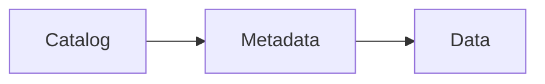

# oku

> Turkish imperative — "read!". A documentation kit that emits
> visual-first HTML artifacts from Markdown sources. Pages render in
> the browser via Custom Elements (no build step for content); the CLI
> builds a deployable multi-page site, a search index, standalone
> single-file copies for offline reading, and an `llms.txt` sitemap for
> LLM consumers.

A documentation kit. Authors write pages in Markdown; the browser
renders them via Custom Elements; the CLI builds a multi-page site, a
search index, and standalone single-file copies for offline reading.
Page-JSON sources (v1/v2) predate the Markdown format and keep
rendering; `oku migrate` converts one when you want it converted.

## What's in the box

- **Sources:** `*.md` — markdown-first. Prose is plain GFM; kit
  primitives are ` ```oku-<kind> ` fences with a compact JSON body;
  ` ```mermaid ` becomes a live diagram (and still renders on GitHub).
  Relative `.md` links retarget to `.html`, definition lists and
  reference-style links, YAML front-matter, and a sanitised inline
  HTML allowlist.
- **Primitives:** paragraph / heading / list / code / annotated-code,
  callout (9 tones, each with a symbol badge), insight, info-tip,
  tldr, kpi-grid, table (sort, filter, chip-rack, view-toggle
  Table / List / Cards / Board with kanban lanes), compare-grid,
  step-flow (click-targetable card cards), chart (53 render
  modes — see below), diagram (Mermaid), live-snippet, glossary
  tooltips, citation cards.
- **53 chart types in one primitive.** scatter · line · area · bubble
  · quadrant · connected-scatter · bar · stacked-bar · grouped-bar ·
  dot-plot · marimekko · waterfall · lollipop · dumbbell ·
  population-pyramid · range-bar · pareto · donut · pie · waffle ·
  treemap · sunburst · polar-area · histogram · box-plot · ridgeline
  · density · violin · beeswarm · hexbin · sparkline · slope ·
  calendar-heatmap · candlestick · stream · bump · horizon · funnel ·
  sankey · gantt · network · chord · arc-diagram · heatmap ·
  scatter-matrix · parallel-coordinates · gauge · bullet · radar ·
  tile-map (alias `geo`, a tile cartogram), plus the `plot` and `arc`
  base modes the kit sets on itself. Every chart shares one
  hover-tooltip controller (click to pin, Escape to close), expands
  into a fullscreen pan/zoom overlay, and tracks the light / dark
  theme tokens.
- **Chrome:** single left sidebar with site-tree + on-page TOC
  stacked, opened by one button in three states (peek on hover,
  pinned, modal below 900px), sticky section TOC with scroll-spy,
  full-text search (Pagefind), forward-compat warning indicator, and
  one presentation menu holding every reader preference — text size
  (80% to 200%, and the charts and diagrams grow with the prose),
  column width (narrow / comfortable / max), a two-stop theme that
  follows the OS until overridden, the language switch, and
  reader-side placeholder personalization.
- **One column, one right edge.** Every block in a section — prose,
  callout, code, table, chart, diagram — ends at the same x, set by
  `--content-width`. Nothing caps a block below it. The reader changes
  the measure with the width control, which has three stops: `narrow`
  (860px), `comfortable` (the default, 1100 → 1240 → 1400 as the
  screen grows) and `max` (the full width of what is available, for wide
  tables and matrices). The text-size control is orthogonal to it: it
  magnifies the column's contents rather than re-flowing the measure.
- **CLI:** `init` symlinks the kit + writes an index stub; `build`
  emits `dist/site/` (multi-page + manifest + `llms.txt` + Pagefind)
  and `dist/standalone/` (single file with inline page JSON); the
  `.md` sources are the AI/LLM surface, so there is no twin tree.
  `clean` drops `dist/`; `check` lints the doctree (schema +
  structural + content); `migrate` converts page-JSON sources to `.md`;
  `serve` runs a local HTTP server with live reload.

## Install

```bash
git clone git@github.com:mmdemirbas/html-doc.git    # repo URL still legacy upstream
cd html-doc
./ctl deploy                                       # `oku` on PATH
```

`./ctl deploy` is also how you push a kit change out to the projects
that use it: it forces a cache-free reinstall and then verifies the
installed tool reports this repo's kit build, rather than leaving you to
compare two version strings by eye. `./ctl` on its own lists everything
else.

Or run in-tree without installing:

```bash
uv run bin/oku serve             # PEP 723 inline metadata pulls deps
python3 bin/oku serve            # plain Python works too (no extras)
```

## Quick start

```bash
mkdir -p my-project/docs && cd my-project/docs
oku init                         # _oku symlink + index.html in cwd
# author *.md pages anywhere under the docs root
oku serve                        # http://localhost:9876 with live reload
```

`oku init` treats the **current directory** as the docs root —
there is no implicit `docs/` subdir. Run it wherever you want pages
to live.

Existing Markdown docs drop into the tree and appear in the site tree
without conversion, as long as they sit inside the strict-GFM subset
the kit lints for: no setext (`===` / `---` underline) headings, no
indented code blocks, no lazy blockquote continuation, and no bare
`---` that could read as either a rule or front-matter. `oku check`
names each one — a setext heading is an error, the rest are warnings.

## Authoring model

Each page is a `*.md` file at any depth under your docs root: YAML
front-matter + a GitHub-flavored markdown body. A thin HTML stub next
to it (`*.html`, copy of `src/oku/templates/starter.html`) bootstraps
the renderer. Kit primitives (charts, rich tables, KPI grids, step
flows, …) are fenced blocks whose body is one compact JSON object:

````markdown
---
title: Iceberg storage layer
eyebrow: Architecture
summary: Open table format with ACID guarantees.
order: 10
---

> [!TLDR]
> Open table format with ACID guarantees.
>
> - Catalog / metadata / data separation
> - Snapshot isolation, time travel

## Overview {#overview}

Iceberg gives [ACID](#g/acid) transactions over object stores.

```oku-chart
{"type":"bar","rows":[{"label":"reads","value":120},{"label":"writes","value":40}]}
```


````

Any external markdown viewer (GitHub, Obsidian, VS Code) renders the
prose, tables, and mermaid natively; `oku-*` fence payloads show as
readable JSON. Need full interactivity? A block-level raw-HTML island
(custom elements, `<script>`, `<style>`) passes through to the kit
untouched — `oku check` audits each one.

Fence payload shapes live in `kit/schema/page.schema.json`; `oku
check` validates every payload against it. Legacy JSON pages (v1/v2)
keep rendering via built-in shims; `oku migrate` converts them to
`.md` in place.

## CLI

Six commands, all run from the project root or a subdirectory:

```bash
oku init                         # one-time, runs in cwd: _oku symlink + index.html stub
oku check                        # lint the doctree (schema + structural + content)
oku check --strict               # exit 1 on warnings too
oku build                        # dist/standalone/ + dist/site/ + search index
oku clean                        # remove dist/ from the current project
oku migrate [path]               # convert page-JSON sources (v1/v2) to v3 .md
oku migrate --dry-run            # list what would change, write nothing
oku serve                        # local HTTP, live reload, Pagefind in background
oku serve --no-watch             # disable filesystem watcher
oku serve --no-search            # skip background Pagefind index
```

`build` writes two single-purpose trees under `dist/`:

- `dist/standalone/` — every HTML inlines kit + page JSON +
  `window.__okuManifest`. Open via `file://`, attach to email.
- `dist/site/` — multi-page site with shared `_oku/` assets, a
  Pagefind index, one `site-manifest.json` at the docs root for the
  runtime page-nav fetch, and `llms.txt` for AI consumers. Drop on
  any static host. The `.md` sources themselves are the canonical
  LLM-readable surface — no twin tree.

`serve` synthesizes `site-manifest.json` and `llms.txt` in memory on
each request so source dirs stay clean.

## Primitives

| Element / kind | Purpose |
|---|---|
| `<glossary-term term="...">` | Inline term. Hover → tooltip; click pins. Multi-domain registry. |
| `<ext-ref name="...">` · `<oku-cite>` | Citation card with type theming (paper / rfc / release / blog / other). Auto-infers type from link domain. |
| `<callout type="note\|info\|tip\|warn\|warning\|caution\|danger\|success\|neutral\|important">` | Block-level themed note. Nine tones (`warn` and `warning` are the same one). |
| `<insight>` | Pull-quote for a key takeaway. |
| `kpi-grid` · `compare-grid` · `step-flow` | Layout primitives, all layout-safe by structure. `compare-grid` carries verdict variants `good` / `bad` / `neutral` (quality contrast) and `in` / `out` (scope contrast); cards accept either a rich `content` body, an `items` bullet list, or both. |
| `<chart type="...">` | Single primitive, 53 render modes grouped by family: Cartesian (scatter / line / area / bubble / quadrant / connected-scatter), Categorical (bar / stacked-bar / grouped-bar / dot-plot / marimekko / waterfall / lollipop / dumbbell / population-pyramid / range-bar / pareto), Part-to-whole (donut / pie / waffle / treemap / sunburst / polar-area), Distribution (histogram / box-plot / ridgeline / density / violin / beeswarm / hexbin), Trend (sparkline / slope / calendar-heatmap / candlestick / stream / bump / horizon), Flow (funnel / sankey / gantt), Network (network / chord / arc-diagram), Multivariate (heatmap / scatter-matrix / parallel-coordinates), Goal (gauge / bullet / radar), Geographic (tile-map, alias `geo`). Shared rich hover tooltip with click-to-pin, click-outside / Esc to close. Cartesian SVG charts add pan / zoom / log scale / legend toggle / PNG export. Every type shares the expand toolbar (copy data / PNG / fullscreen pan + zoom) and the extended series-colour palette (10 distinguishable tokens, light + dark theme); no third-party chart library. |
| `<diagram>` | Mermaid wrapper. Lazy-loads from CDN. Re-renders on theme toggle. Has Copy-source, Copy-SVG, Screenshot buttons. |
| `<live-snippet>` | Editable HTML/CSS/JS textarea + sandboxed iframe preview. |
| `annotated-code` | Code block with numbered `(1)`(2) chips that sync with a side panel of annotations. |
| `table` (flat or grouped) | Rich tables with sort, filter, view-switcher (Table/List/Cards), sticky headers, full-width toggle. |
| `data-bind="X"` | Any two elements with the same key flash together on hover/focus. Stripe-class prose↔code sync. |

Layout / chrome: `<page-chrome>` (the reading-progress rail and its
landmark minimap), `<page-nav>` (the Contents drawer, holding the site
tree), `<page-toc>` (the on-page TOC, adopted as a child of `page-nav`
at boot so both stack in one panel).

Every chrome button — Contents, personalize, search, warning, width,
theme — is a child of `.okt-chrome-cluster` on `<body>`, ordered by CSS
`order:` rather than by hand-set offsets. The Contents button sits in
the top-left strip and drives three drawer states: **peek** on hover
(nothing on the page moves), **pinned** on click at ≥900px (the column
insets by `--oku-drawer-w` and stays open while you read), and
**modal** on click below 900px.

## Inline placeholder personalization

Declare keys in `kit.json`:

```json
{
  "personalization": [
    { "key": "apiKey",    "label": "API Key",    "default": "sk_test_..." },
    { "key": "projectId", "label": "Project ID" }
  ]
}
```

Snippets that contain `{{apiKey}}` swap in the reader's value at render
time. The Placeholders row in the presentation menu opens the panel;
values persist in `localStorage`. No server, no account.

## Design principles

Four load-bearing rules. They apply to visual style **and** to content
design — every artifact respects them at both layers.

1. **Proximity.** Related things go together. A table's filter sits on
   the table. Caveat next to the claim it qualifies.
2. **Hierarchy.** Three weights of heading, two of body, one accent.
   Top-level conclusion before nested reasoning.
3. **Schema.** Every page kind has predictable parts (cover, TL;DR,
   sections, references).
4. **Grouping.** Visual cues bind related items. Bullets for parallel,
   numbered for ordered, indentation for nested.

## Multi-domain glossary + citations

Glossaries are per-domain, each with multi-language entries:

```text
_oku/glossary/
  data-platforms.json    # Iceberg, Spark, Flink, ACID, MVCC, ...
  web.json               # Custom Elements, Shadow DOM, FOUC, ...
  ai-llm.json            # RAG, tokenization, embedding, ...
```

`docs/kit.json` declares the active domains, preferred language, and
per-project overrides:

```json
{
  "domains": ["data-platforms", "web", "ai-llm"],
  "lang": "en",
  "lang_fallback": ["en"],
  "glossary": {
    "data-platforms": {
      "ProjectInternalTerm": { "en": { "def": "..." } }
    }
  }
}
```

Disambiguation when two domains define the same term:

```json
{ "kind": "glossary-term", "term": "ACID", "in": "chemistry" }
```

External references in `_oku/extrefs/<domain>.json` carry the same
shape with an optional `type` (paper / rfc / release / blog / other),
`author`, and `published` for citation-card metadata.

## Forward-compat warning indicator

Top-right warning button (with count badge) surfaces when:

- `window.error` or `unhandledrejection` fires.
- The renderer hits an unknown JSON node `kind`.
- The manifest or `kit.json` has a `schema_version` newer than the
  kit understands.
- A glossary term or citation isn't in any active domain.
- A manifest fetch fails (with HTTP status, where applicable).

Click opens a panel listing entries; Dismiss closes it for the session.

## Tests

```bash
uv run pytest -q                            # the whole suite, CLI + browser
oku check --strict                          # schema + structural + content lint
```

Covers the pure converter (Markdown front-matter, nested lists,
footnotes, definition lists, reference-style links, sanitised inline
HTML), schema validation on every published page, the build helpers
(`build_manifest`, `build_llms_txt`, `extract_page_text`,
`inject_pagefind_body`) via `tmp_path`
fixtures, and content-regression tests that lock the chrome.js /
chrome.css markers the user has called out as load-bearing.

## Versioning

Tags follow semver. Symlink users get HEAD; pull when you want updates.
CDN consumers should pin to a tag — e.g.
`https://cdn.jsdelivr.net/gh/mmdemirbas/html-doc@v0.2.0/chrome.css`.

History lives in the git log (`git log --oneline`).

## Roadmap

`docs/roadmap.md` (or the live page at `docs/roadmap.html`) carries the
open work, the recent landings, and the locked design decisions.

## Companion files

- `src/oku/templates/starter.md` + `src/oku/templates/starter.html` — the pair to copy when starting a new page.
- `kit/schema/page.schema.json` — the page schema; editors pick this up via the `$schema` field.
- `docs/` — the project's own docs (built with the kit, dogfood).
- `docs/roadmap.md` — phase tracker.
