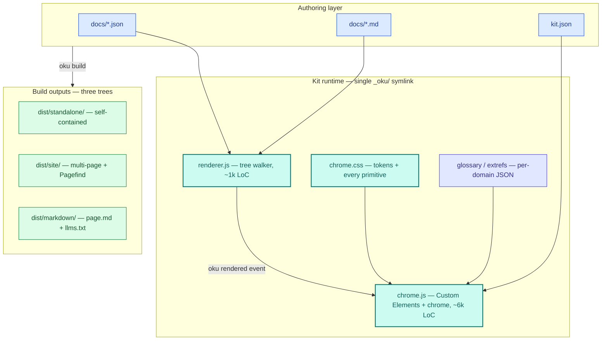
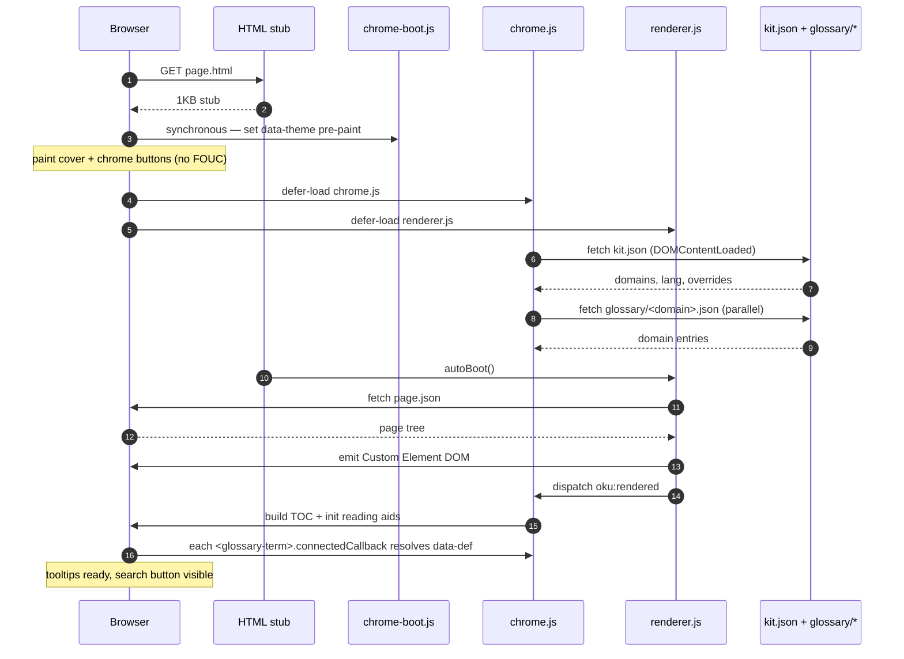
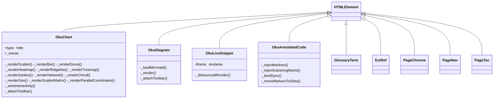
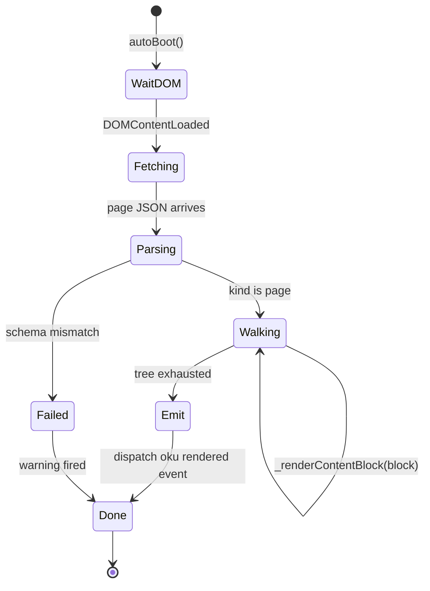
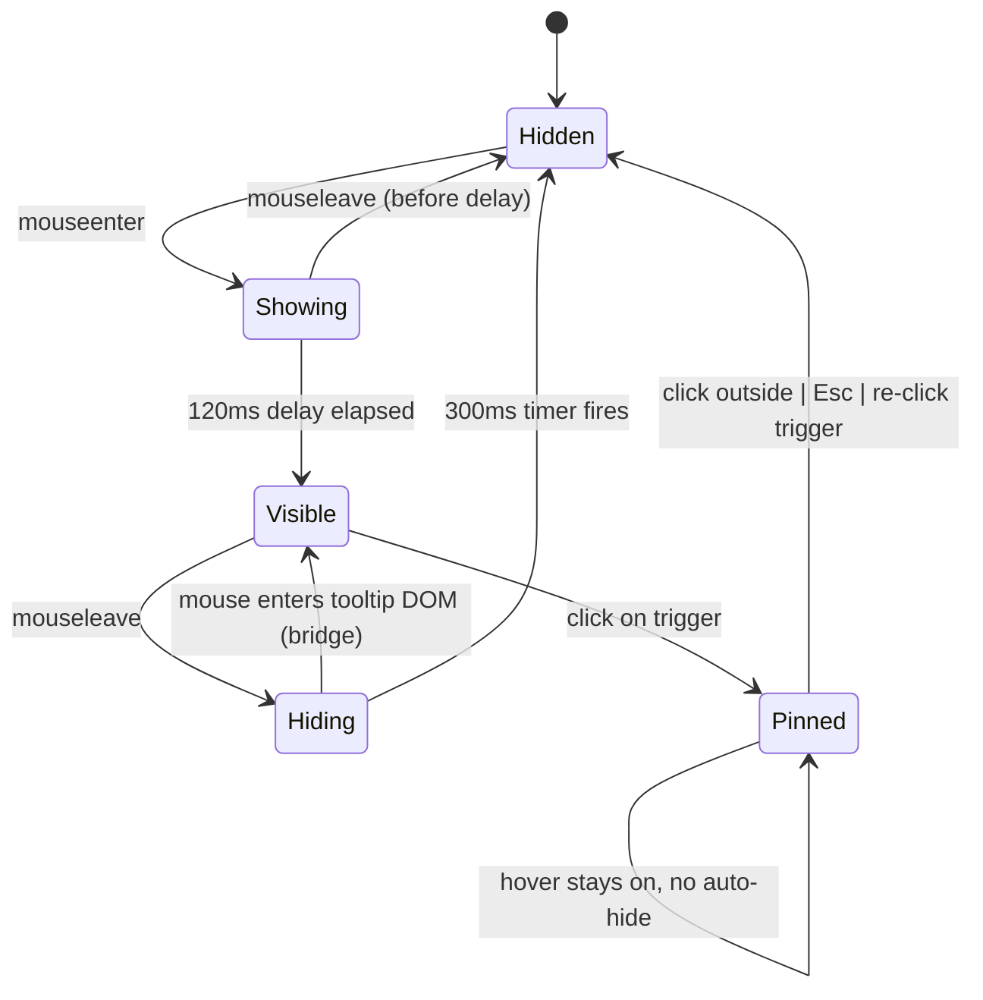
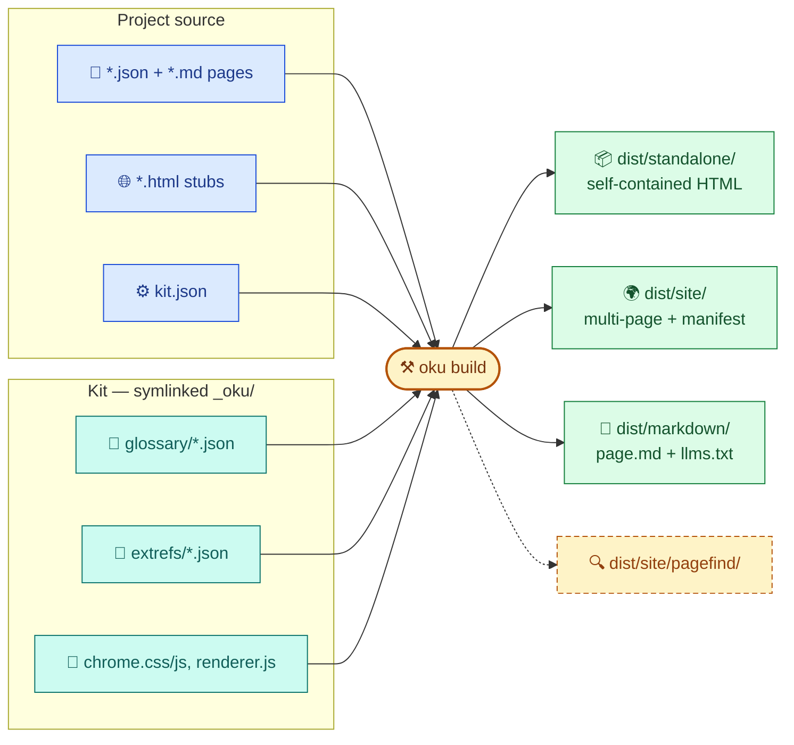

> [!TLDR]
> JSON pages are walked by renderer.js at load time and turned into Custom-Element DOM. chrome.js owns the behavior of those Custom Elements plus the page-level chrome (TOC, search, theme, warnings, viewport tracking). The whole kit lives in three JS files + one CSS file + JSON registry files.
>
> - Format: JSON tree → renderer.js walks it → Custom Element DOM → chrome.js attaches behavior.
> - kit.json + per-domain glossary/extref JSON files are the registry; loaded once at page start, resolved per element.
> - Visual Viewport API keeps fixed-position chrome buttons anchored during pinch-zoom on Safari.
> - Build pipeline (oku CLI) emits three single-purpose trees under dist/: standalone/ (self-contained HTMLs), site/ (multi-page + Pagefind + manifest), markdown/ (page.md twins + llms.txt).

## Layered overview {#overview}

Author content sits on top; the kit runtime hydrates it; build outputs flow out the bottom. Same kit, three distribution shapes.



*Author → kit → build at a single glance.*

## Files in the kit {#files}

The kit repo contains all the runtime plus the registry data plus the CLI.

```text
oku/
├── bin/oku                  # Python CLI — init, build, serve
├── src/html_doc/                 # CLI implementation
│   └── templates/                # starter page pair for `oku init`
├── src/html_doc_tests/           # pytest suite
├── kit/                          # chrome.{js,css}, chrome-boot.js, renderer.js,
│                                 # schema/, glossary/, extrefs/
├── docs/                         # this site — JSON-only sources + _oku symlink
├── examples/                     # tour pages — same shape as docs/
└── README.md, CLAUDE.md
```

> [!TIP] Single-file split rationale
> chrome.js is ~4.5k lines in one file. Splitting it would mean either more script tags in every stub (worse onboarding) or a build step (more complexity, defeating the no-build-for-content goal). The current bet: one file with a clear table of contents at the top (see the section banner there). Reviewed each time the design changes shape; still wins on author ergonomics.

## Runtime — when a page loads {#render-flow}

From the moment the browser receives the HTML stub to the moment the page is interactive.



*Lifecycle of a page load.*

## The renderer {#renderer}

renderer.js is a tree walker. It maps each JSON node's kind to a Custom Element instantiation (for interactive primitives) or directly to a styled DOM subtree (for prose primitives). The renderer is ~500 lines of straightforward code.



*Custom Element class layout. Renderer instantiates these by tag; chrome.js owns their lifecycles.*



*Renderer state — single pass over the tree; emits a CustomEvent at the end so chrome.js post-processors can pick up the new DOM.*

- `render(page)` — sets document.title, picks up accent override, renders cover, walks blocks.
- `_renderTopBlock` / `_renderContentBlock` — switch on kind; each kind has a small _renderX function.
- `_renderRich` — walks paragraph.content arrays mixing strings (textContent) with inline nodes (createElement).
- For complex primitives (chart, diagram, snippet), the renderer creates the Custom Element with attributes and a JSON-payload script child. The Custom Element's connectedCallback parses the payload and renders its own DOM.

> [!NEUTRAL] Why JSON-payload-as-script-child for complex primitives
> Attribute values can't safely encode multi-line strings or nested objects. A child <script type="application/json"> sidesteps the encoding problem entirely — the Custom Element does JSON.parse on its textContent.

## Tooltip controller {#tooltip}

Single global controller, attached to both glossary-term and ext-ref elements. ~150 lines.



*Tooltip lifecycle. Hover and click paths are explicit; pinned is a sticky state with two exits.*

```oku-step-flow
{"steps":[{"t":"Hover detection","b":"matchMedia('(hover: none)') gates the hover path — touch devices skip it and use click only. Re-evaluated per attach so input-mode changes mid-session take effect on later elements."},{"t":"Show with delay","b":"120ms delay on mouseenter before showing — prevents flicker when brushing past."},{"t":"Bridge-hover","b":"On mouseleave, start a 300ms hide timer. If the mouse enters the tooltip DOM during that window, the timer cancels — the tooltip stays so the user can select text or click links."},{"t":"Click to pin","b":"Clicking the term pins the tooltip — it stays open until clicked again or another term is opened. Visible 2px accent ring marks pinned."},{"t":"Click outside / Esc","b":"Click anywhere outside .gloss or .tooltip-popup unpins. Escape key also unpins. Touch devices have click-only — no hover path, so click toggles pinned."}]}
```

## Visual Viewport API — pinch-zoom {#viewport}

Fixed-position chrome anchored to the user-visible viewport rather than the layout viewport. Without this, pinch-zoom on Safari moves the visual viewport and the chrome buttons drift off-screen.

```js
// chrome.js — runs at module init
var vv = window.visualViewport;
function sync() {
  document.documentElement.style.setProperty('--vv-left', vv.offsetLeft + 'px');
  document.documentElement.style.setProperty('--vv-top',  vv.offsetTop  + 'px');
}
vv.addEventListener('scroll', sync);
vv.addEventListener('resize', sync);

// chrome.css
.ctrl-btn { transform: translate(var(--vv-left,0), var(--vv-top,0)); }
```

Two CSS variables, one event handler. `?.` optional chaining gates the whole thing on Visual Viewport API support — graceful degrade on browsers without it (buttons stay at layout-viewport corners, same as v1).

## kit.json + glossary loader {#kit-loader}

Loads kit.json (project config) and per-domain glossary/extref files. Promise-based; returns a promise that resolves to the populated kit when all fetches complete.

```oku-step-flow
{"steps":[{"t":"Defer","b":"Initial load deferred to DOMContentLoaded — gives the standalone build a chance to inline the kit bundle before fetch tries to run."},{"t":"Standalone check","b":"If the page has an inline __oku_kit_bundle__ script (set by build_standalone), hydrate from it synchronously and skip all fetches."},{"t":"Standalone-but-no-bundle","b":"If __oku_page__ is present but no bundle (i.e., handwritten standalone), resolve with an empty kit — tooltips degrade to plain text rather than showing 'Unknown term' for everything."},{"t":"Dev / dist/site/ path","b":"Fetch kit.json + each domain's glossary/extref file in parallel. After Promise.all resolves, apply project-local overrides on top. Then resolve and unblock any waiters."}]}
```

## Docs-root discovery {#docs-root}

kit.json and site-manifest.json live at the docs root (the directory containing _oku/), not next to each page. The kit derives that root from any page depth so subdir pages resolve their assets without per-page configuration.

```js
// chrome.js — runs once at module init
var __okuDocsRoot = (function () {
  var refs = document.querySelectorAll('link[href*="_oku/"], script[src*="_oku/"]');
  for (var i = 0; i < refs.length; i++) {
    var url = refs[i].href || refs[i].src;
    var idx = url.indexOf('/_oku/');
    if (idx >= 0) return url.slice(0, idx + 1);  // ends with /
  }
  return new URL('.', window.location.href).href;  // fallback
})();
```

Any element referencing `_oku/` gives us a URL with the docs root as its prefix — strip everything from `/_oku/` onward. All kit.json, site-manifest.json, glossary/*.json, and pagefind/ fetches use this base, so subfolder pages work without per-page configuration.

## Build pipeline {#build}

bin/oku build walks the project and emits three single-purpose dist/ trees, one per audience. Soft-fails on optional dependencies (Pagefind, jsonschema) so the kit doesn't acquire hard requirements.



*Build inputs and the three dist trees. Colour codes: blue = author content; teal = kit runtime; green = build outputs; amber = optional dependency.*

1. walk the project recursively for JSON pages with `kind: "page"` plus *.md files (skipping project-meta files like README.md, CLAUDE.md).
2. if jsonschema is installed, validate every page against schema/page.schema.json; print errors with field paths. Structural lint runs regardless of jsonschema.
3. build_standalone: for each page, inline chrome.css + chrome.js + renderer.js + page JSON + kit bundle + window.__okuManifest seed into a single self-contained HTML. No external dependencies beyond Google Fonts and Mermaid CDN (when used).
4. build_site: copy every HTML stub + sibling JSON into dist/site/<rel-path>; copy _oku/ as dist/site/_oku/ once; embed extracted text via hidden data-pagefind-body div for indexing.
5. write a single site-manifest.json under dist/site/<docs-root>/. chrome.js fetches it at runtime to populate the page-nav sidebar.
6. build_markdown_twins + build_llms_txt: emit per-page page.md plus a single llms.txt sitemap under dist/markdown/. LLM-readable, never duplicated across the human trees.
7. if pagefind is on PATH, index dist/site/ to dist/site/pagefind/.

## Standalone kit bundle {#standalone-bundle}

build_standalone embeds the project's kit.json + active domain glossary + extref entries as one JSON script tag. The kit loader hydrates from it synchronously when present.

```html
<!-- dist/standalone/page.html — near the closing </body> -->
<script type="application/json" id="__oku_page__">{ ... page tree ... }</script>
<script type="application/json" id="__oku_kit_bundle__">{
  "kit": { "domains": ["data-platforms", ...], "lang": "en", ... },
  "glossary": { "data-platforms": { "ACID": { ... } }, ... },
  "extrefs":  { "data-platforms": { ... }, ... }
}</script>
```

> [!SUCCESS] Result — single-file offline tooltips
> A single HTML file you can email or archive. All Custom Elements work, tooltips resolve, the page renders. Network requirements: Google Fonts (graceful fallback if blocked) and Mermaid CDN (only if the page has a <diagram>). Everything else inlined.

## Internal architecture notes {#internal-architecture-notes}

Five behaviors worth knowing about if you're reading the kit code.

> [!NOTE] Kit assets resolver
> Two valid asset layouts now: development (chrome.{css,js} at repo root) and installed (chrome.{css,js} inside <code>html_doc/assets/</code> in the wheel). <code>cli._kit_assets_dir()</code> picks whichever exists, so <code>oku init</code> works from a clone OR from <code>uv tool install .</code>. Hatchling <code>force-include</code> in pyproject packs the assets into the right place at wheel build time.

> [!NOTE] Generated artifacts live under dist/, never source
> <code>oku build</code> writes site-manifest.json (dist/site/), llms.txt (dist/markdown/), and page.md twins (dist/markdown/) at the closest common parent of JSON pages — picked by <code>_common_docs_dir(root, pages)</code> in cli.py, typically <code>docs/</code>. <code>oku serve</code> doesn't write at all — it synthesizes site-manifest.json and llms.txt in memory on each request so source dirs stay authored-content-only.

> [!NOTE] Serve-time Pagefind
> <code>cmd_serve</code> spawns a background thread at startup that builds <code>dist/_search/site/</code> (just like <code>cmd_build</code>) and runs pagefind against it. Symlinks <code>&lt;docs-dir&gt;/pagefind</code> → that index so chrome.js's existing search-loader path resolves. Soft-fails if pagefind isn't installed. Opt out with <code>--no-search</code>.

> [!NOTE] Boot stamp
> chrome.js console.info()s <code>[oku] kit boot · build=&lt;date&gt; · docsRoot=… · authToken=yes/no</code> at startup. Bump <code>__okuKitBuild</code> whenever a compatibility-affecting change ships so a stale-cache user can confirm from DevTools whether their browser is on the right chrome.js.

> [!NOTE] IntelliJ _ijt token propagation
> chrome-boot.js plucks <code>_ijt</code> from <code>window.location.search</code> and exposes <code>window.__okuWithAuth(url)</code> that appends it to internal asset URLs (same-origin only — CDN URLs stay untouched). chrome.js and renderer.js wrap every fetch and script-src load through it so IntelliJ's built-in server stops 404'ing sub-resource requests.
