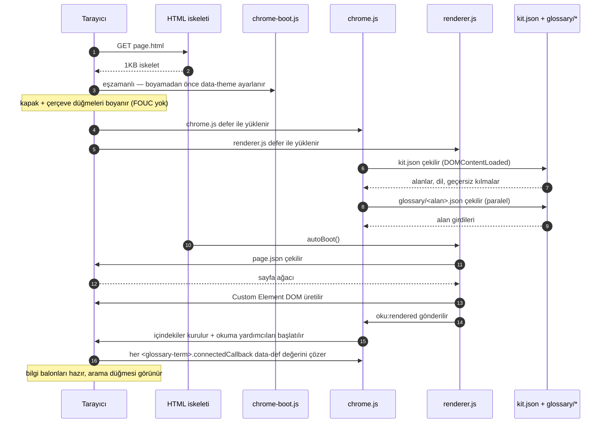
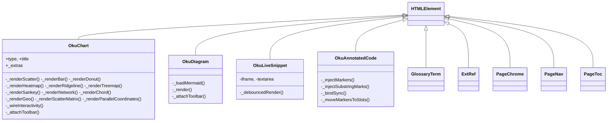
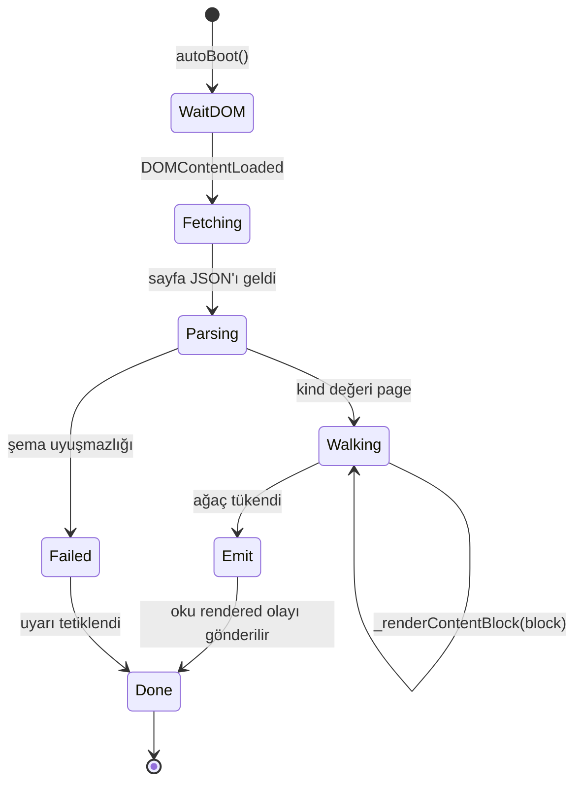
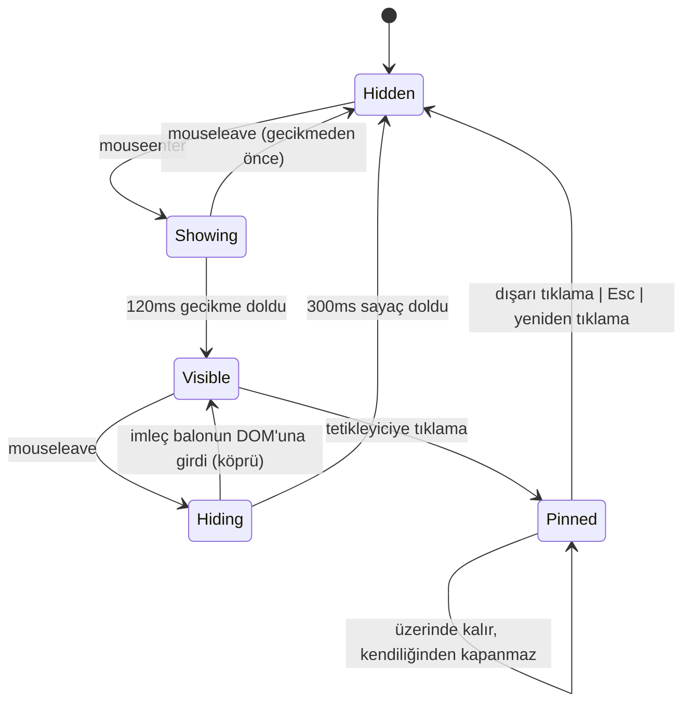

> [!TLDR]
> Sayfa sözlüğünü renderer.js yükleme anında gezer ve Custom Element DOM'una çevirir. CLI her `.md` kaynağını bu sözlüğe dönüştürür; sayfa-JSON kaynakları zaten o biçimdedir. Bu Custom Element'lerin davranışı ile sayfa düzeyindeki çerçeve (içindekiler, arama, tema, uyarılar, görüntü alanı takibi) chrome.js'in sorumluluğundadır. Kitin tamamı üç JS dosyası, bir CSS dosyası ve JSON kayıt dosyalarından oluşur.
>
> - Akış: `.md` kaynağı → sayfa sözlüğü → renderer.js onu gezer → Custom Element DOM → chrome.js davranışı bağlar.
> - kit.json ile alan başına sözlük/dış-kaynak JSON dosyaları kayıt defteridir; sayfa açılışında bir kez yüklenir, her öğe için ayrı çözülür.
> - Visual Viewport API, Safari'de parmakla yakınlaştırma sırasında sabit konumlu çerçeve düğmelerini yerinde tutar.
> - Derleme hattı (oku CLI) dist/ altında tek amaçlı iki ağaç üretir: standalone/ (kendi kendine yeten HTML dosyaları) ve site/ (çok sayfalı + Pagefind + manifest + llms.txt). `.md` kaynakları yapay zekâ/LLM yüzeyinin kendisi olduğu için ikiz bir ağaç üretilmez.

## Katmanlara genel bakış {#overview}

Yazarın içeriği en üstte durur; kitin çalışma zamanı onu canlandırır; derleme çıktıları alttan akar. Aynı kit, iki dağıtım biçimi.

```mermaid
flowchart TB
    subgraph A[Yazım katmanı]
      direction LR
      MD["docs/*.md"]:::auth
      JSON["docs/*.json — eski biçim"]:::auth
      KITJ["kit.json"]:::auth
    end
    subgraph R[Kit çalışma zamanı — tek _oku/ sembolik bağı]
      direction TB
      RND["renderer.js — ağaç gezici, ~2.6k satır"]:::rt
      CHR["chrome.js — Custom Element'ler + çerçeve, ~13k satır"]:::rt
      CSS["chrome.css — değişkenler + her bileşen"]:::rt
      REG["sözlük / dış kaynaklar — alan başına JSON"]:::reg
    end
    subgraph O[Derleme çıktıları — iki ağaç]
      direction LR
      STA["dist/standalone/ — kendi kendine yeten"]:::out
      SIT["dist/site/ — çok sayfalı + Pagefind + llms.txt"]:::out
    end
    JSON --> RND
    MD --> RND
    KITJ --> CHR
    REG --> CHR
    RND -->|oku rendered olayı| CHR
    CSS --> CHR
    A -->|oku build| O
    classDef auth fill:var(--series-7-soft),stroke:var(--series-7),color:var(--text)
    classDef rt fill:var(--series-1-soft),stroke:var(--series-1),color:var(--text),stroke-width:2px
    classDef reg fill:var(--series-3-soft),stroke:var(--series-3),color:var(--text)
    classDef out fill:var(--series-5-soft),stroke:var(--series-5),color:var(--text)
```

*Yazar → kit → derleme, tek bakışta.*

## Kitin dosyaları {#files}

Kit deposu çalışma zamanının tamamını, kayıt verisini ve CLI'ı birlikte taşır.

```text
oku/
├── bin/oku                       # PEP 723 shim — run without install
├── src/oku/                      # CLI: init, build, clean, migrate, check, serve
│   └── templates/                # starter page pair for `oku init`
├── src/oku_tests/                # pytest suite
├── kit/                          # chrome.{js,css}, chrome-boot.js, renderer.js,
│                                 # schema/, glossary/, extrefs/
├── docs/                         # this site — .md sources + _oku symlink
├── examples/                     # tour pages — same shape as docs/
└── README.md, CLAUDE.md
```

> [!TIP] Tek dosyada tutmanın gerekçesi
> chrome.js tek dosyada ~13 bin satırdır. Bölmek ya her iskelet dosyasına daha fazla script etiketi eklemeyi (işe başlamayı zorlaştırır) ya da bir derleme adımı getirmeyi (karmaşıklığı artırır, içerik için derleme yok hedefini bozar) gerektirirdi. Şu anki tercih: başında net bir içindekiler listesi bulunan tek dosya (oradaki bölüm başlıklarına bakın). Tasarım her biçim değiştirdiğinde yeniden gözden geçirilir; yazar ergonomisi açısından hâlâ öne çıkıyor.

## Çalışma zamanı — bir sayfa yüklenirken {#render-flow}

Tarayıcının HTML iskeletini aldığı andan sayfanın etkileşime hazır olduğu ana kadar.



*Bir sayfa yüklemesinin yaşam döngüsü.*

## Renderer {#renderer}

renderer.js bir ağaç gezicisidir. Her düğümün türünü ya bir Custom Element örneklemesine (etkileşimli bileşenler için) ya da doğrudan biçimlendirilmiş bir DOM alt ağacına (metin bileşenleri için) eşler, `b[]` içindeki markdown dizelerini de kendi GFM blok ayrıştırıcısıyla çözer. Yaklaşık 2.6 bin satırdır.



*Custom Element sınıf yerleşimi. Renderer bunları etiketlerine göre örnekler; yaşam döngüleri chrome.js'e aittir.*



*Renderer durumları — ağaç üzerinde tek geçiş; sonunda bir CustomEvent yayınlar, böylece chrome.js'in son işlem adımları yeni DOM'u yakalayabilir.*

- `render(page)` — document.title'ı ayarlar, vurgu rengi geçersiz kılmasını alır, kapağı çizer, blokları gezer.
- `_renderTopBlock` / `_renderContentBlock` — türe göre dallanır; her türün küçük bir _renderX işlevi vardır.
- `_renderRich` — dizeleri (textContent) satır içi düğümlerle (createElement) karıştıran paragraph.content dizilerini gezer.
- Karmaşık bileşenlerde (grafik, şema, canlı örnek) renderer, Custom Element'i öznitelikleriyle ve JSON yükünü taşıyan bir alt script ile oluşturur. Öğenin connectedCallback'i yükü ayrıştırır ve kendi DOM'unu çizer.

> [!NEUTRAL] Karmaşık bileşenlerde JSON yükü neden alt script olarak taşınıyor
> Öznitelik değerleri çok satırlı dizeleri ya da iç içe nesneleri güvenli biçimde kodlayamaz. Alt öğe olarak duran bir <script type="application/json"> kodlama sorununu tümüyle ortadan kaldırır — Custom Element yalnızca textContent üzerinde JSON.parse çağırır.

## Bilgi balonu denetleyicisi {#tooltip}

Hem glossary-term hem de ext-ref öğelerine bağlanan tek bir genel denetleyici. Yaklaşık 150 satır.



*Bilgi balonunun yaşam döngüsü. İmleç ve tıklama yolları ayrı ayrı tanımlıdır; sabitlenmiş durum iki çıkışı olan kalıcı bir durumdur.*

```oku-step-flow
{"steps":[{"t":"İmleç algılama","b":"matchMedia('(hover: none)') imleç yolunu kapıda tutar — dokunmatik cihazlar bu yolu atlar ve yalnızca tıklamayı kullanır. Her bağlanmada yeniden değerlendirilir, böylece oturum ortasında değişen giriş biçimi sonraki öğelerde geçerli olur."},{"t":"Gecikmeli gösterim","b":"mouseenter sonrası göstermeden önce 120ms beklenir — imleç yanından geçerken oluşan titremeyi önler."},{"t":"Köprü davranışı","b":"mouseleave anında 300ms'lik bir gizleme sayacı başlar. İmleç bu aralıkta balonun DOM'una girerse sayaç iptal olur — balon açık kalır, okuyucu metni seçebilir ya da bağlantılara tıklayabilir."},{"t":"Tıklayarak sabitleme","b":"Terime tıklamak balonu sabitler — yeniden tıklanana ya da başka bir terim açılana kadar açık kalır. Sabitlenmiş durumu 2px'lik görünür bir vurgu halkası belirtir."},{"t":"Dışarı tıklama / Esc","b":".gloss ya da .tooltip-popup dışında herhangi bir yere tıklamak sabitlemeyi kaldırır. Escape tuşu da kaldırır. Dokunmatik cihazlarda yalnızca tıklama vardır — imleç yolu olmadığı için tıklama sabitlemeyi açıp kapatır."}]}
```

## Visual Viewport API — parmakla yakınlaştırma {#viewport}

Sabit konumlu çerçeve, yerleşim görüntü alanına değil kullanıcının gerçekten gördüğü görüntü alanına bağlanır. Bu olmadan Safari'de parmakla yakınlaştırma görsel görüntü alanını kaydırır ve çerçeve düğmeleri ekranın dışına kayar.

```js
// chrome.js — runs at module init
var vv = window.visualViewport;
function sync() {
  document.documentElement.style.setProperty('--vv-left', vv.offsetLeft + 'px');
  document.documentElement.style.setProperty('--vv-top',  vv.offsetTop  + 'px');
}
vv.addEventListener('scroll', sync);
vv.addEventListener('resize', sync);

// chrome.css
.ctrl-btn { transform: translate(var(--vv-left,0), var(--vv-top,0)); }
```

İki CSS değişkeni, bir olay işleyici. `?.` isteğe bağlı zincirleme, tüm mekanizmayı Visual Viewport API desteğine bağlar — desteklemeyen tarayıcılarda sorunsuzca geriye düşer (düğmeler v1'deki gibi yerleşim görüntü alanının köşelerinde kalır).

## kit.json + sözlük yükleyici {#kit-loader}

kit.json'ı (proje ayarları) ve alan başına sözlük/dış-kaynak dosyalarını yükler. Promise tabanlıdır; tüm çekmeler tamamlandığında dolu kite çözülen bir promise döndürür.

```oku-step-flow
{"steps":[{"t":"Erteleme","b":"İlk yükleme DOMContentLoaded'a ertelenir — böylece standalone derlemesi, fetch çalışmayı denemeden önce kit paketini gömme fırsatı bulur."},{"t":"Standalone denetimi","b":"Sayfada gömülü bir __oku_kit_bundle__ script'i varsa (build_standalone yerleştirir), kit oradan eşzamanlı olarak doldurulur ve hiçbir çekme yapılmaz."},{"t":"Standalone ama paket yok","b":"__oku_page__ var ama paket yoksa (yani elle yazılmış bir standalone dosya), boş bir kitle çözülür — bilgi balonları her terim için 'Bilinmeyen terim' göstermek yerine düz metne geriler."},{"t":"Geliştirme / dist/site/ yolu","b":"kit.json ile her alanın sözlük/dış-kaynak dosyası paralel çekilir. Promise.all çözüldükten sonra projeye özgü geçersiz kılmalar üzerine uygulanır. Ardından çözülür ve bekleyenlerin önü açılır."}]}
```

## Belge kökünü bulma {#docs-root}

kit.json ve site-manifest.json her sayfanın yanında değil, belge kökünde (_oku/ dizinini içeren dizinde) durur. Kit bu kökü sayfanın hangi derinlikte olduğuna bakmaksızın türetir, böylece alt dizinlerdeki sayfalar varlıklarını sayfa başına ayar gerektirmeden çözer.

```js
// chrome.js — runs once at module init
var __okuDocsRoot = (function () {
  var refs = document.querySelectorAll('link[href*="_oku/"], script[src*="_oku/"]');
  for (var i = 0; i < refs.length; i++) {
    var url = refs[i].href || refs[i].src;
    var idx = url.indexOf('/_oku/');
    if (idx >= 0) return url.slice(0, idx + 1);  // ends with /
  }
  return new URL('.', window.location.href).href;  // fallback
})();
```

`_oku/` yolunu içeren herhangi bir öğe, önekinde belge kökü bulunan bir URL verir — `/_oku/` ve sonrasını atmak yeter. kit.json, site-manifest.json, glossary/*.json ve pagefind/ çekmelerinin hepsi bu tabanı kullanır, dolayısıyla alt klasördeki sayfalar sayfa başına ayar gerektirmez.

## Derleme hattı {#build}

`oku build` projeyi gezer ve her biri tek bir okur kitlesine hizmet eden iki dist/ ağacı üretir: tek bir dosyayı okuyan insan için standalone, yayına alınmış bir ağaçta gezinen insan için site. Pagefind isteğe bağlıdır ve eksikliği derlemeyi durdurmaz, dolayısıyla onsuz bir proje de derlenir.

```mermaid
flowchart LR
    subgraph IN[Proje kaynağı]
      direction TB
      P["📄 *.json + *.md sayfaları"]:::content
      H["🌐 *.html iskeletleri"]:::content
      KJ["⚙ kit.json"]:::content
    end
    subgraph K[Kit — sembolik bağlı _oku/]
      direction TB
      KIT["🎨 chrome.css/js, renderer.js"]:::kit
      G["📖 glossary/*.json"]:::kit
      E["🔗 extrefs/*.json"]:::kit
    end
    BUILD(["⚒ oku build"]):::builder
    P --> BUILD
    H --> BUILD
    KJ --> BUILD
    G --> BUILD
    E --> BUILD
    KIT --> BUILD
    BUILD --> S["📦 dist/standalone/<br/>kendi kendine yeten HTML"]:::output
    BUILD --> SI["🌍 dist/site/<br/>çok sayfalı + manifest"]:::output
    BUILD -.-> PF["🔍 dist/site/pagefind/"]:::optional
    classDef content fill:var(--series-7-soft),stroke:var(--series-7),color:var(--text)
    classDef kit fill:var(--series-1-soft),stroke:var(--series-1),color:var(--text)
    classDef builder fill:var(--series-2-soft),stroke:var(--series-2),color:var(--text),stroke-width:2px
    classDef output fill:var(--series-5-soft),stroke:var(--series-5),color:var(--text)
    classDef optional fill:var(--series-2-soft),stroke:var(--series-2),color:var(--text),stroke-dasharray: 5 3
```

*Derleme girdileri ve iki dist ağacı. Renk kodları: mavi = yazar içeriği; turkuaz = kit çalışma zamanı; yeşil = derleme çıktıları; kehribar = isteğe bağlı bağımlılık.*

1. proje içinde özyinelemeli olarak *.md dosyaları ile `kind: "page"` taşıyan JSON sayfaları taranır (README.md, CLAUDE.md gibi proje üstverisi dosyaları atlanır).
2. her sayfa schema/page.schema.json'a karşı doğrulanır; hatalar alan yollarıyla birlikte basılır. jsonschema zorunlu bir bağımlılık olduğu için bu geçiş kurulu her oku sürümünde çalışır; düz `python3 bin/oku` yolu onu bulamayabilir ve bir uyarı notuyla atlar. Yapısal denetim her iki durumda da çalışır.
3. build_standalone: her sayfa için chrome.css + chrome.js + renderer.js + sayfa JSON'ı + kit paketi + window.__okuManifest tohumu tek bir kendi kendine yeten HTML dosyasına gömülür. Google Fonts ve (kullanılıyorsa) Mermaid CDN dışında dış bağımlılık kalmaz.
4. build_site: her HTML iskeleti ve yanındaki JSON dist/site/<göreli-yol> altına kopyalanır; _oku/ bir kez dist/site/_oku/ olarak kopyalanır; dizinleme için çıkarılan metin gizli bir data-pagefind-body div'ine gömülür.
5. site kökünde (dist/site/) tek bir site-manifest.json yazılır. chrome.js belge kökünü, _oku/ dizinini barındıran klasöre kadar geri sıyırarak çözer ve build_site kiti bir kez dist/site/_oku/ altına kopyalar — dolayısıyla manifest onun yanına aittir ve içindeki sayfa yolları proje köküne görelidir.
6. build_llms_txt: site kökünde, manifestin yanında tek bir llms.txt site haritası üretilir. `.md` sayfa kaynakları yapay zekâ/LLM için kanonik yüzey olduğundan hiçbir şey ikiz bir ağaca kopyalanmaz.
7. pagefind erişilebilirse — önce `oku[search]` ekiyle gelen paketli ikili, sonra PATH üzerindeki bir `pagefind`, sonra `npx pagefind` — dist/site/ dizinlenip dist/site/pagefind/ altına yazılır.

## Standalone kit paketi {#standalone-bundle}

build_standalone, projenin kit.json'ını, etkin alan sözlüğünü ve dış-kaynak girdilerini tek bir JSON script etiketi olarak gömer. Kit yükleyici bu etiket varsa içeriği eşzamanlı olarak oradan alır.

```html
<!-- dist/standalone/page.html — near the closing </body> -->
<script type="application/json" id="__oku_page__">{ ... page tree ... }</script>
<script type="application/json" id="__oku_kit_bundle__">{
  "kit": { "domains": ["data-platforms", ...], "lang": "en", ... },
  "glossary": { "data-platforms": { "ACID": { ... } }, ... },
  "extrefs":  { "data-platforms": { ... }, ... }
}</script>
```

> [!SUCCESS] Sonuç — tek dosyada, çevrimdışı çalışan bilgi balonları
> E-postayla gönderebileceğiniz ya da arşivleyebileceğiniz tek bir HTML dosyası. Bütün Custom Element'ler çalışır, bilgi balonları çözülür, sayfa çizilir. Ağ gereksinimi: Google Fonts (engellenirse sorunsuz geriler) ve Mermaid CDN (yalnızca sayfada <diagram> varsa). Kalan her şey gömülüdür.

## İç mimariye dair notlar {#internal-architecture-notes}

Kitin kodunu okuyorsanız bilmeye değer beş davranış.

> [!NOTE] Kit varlıklarını bulan çözücü
> İki geçerli varlık yerleşimi vardır: geliştirme (depodaki `kit/`) ve kurulu sürüm (aynı dosyalar wheel içindeki `oku/assets/` altında). `cli._kit_assets_dir()` hangisi varsa onu seçer, böylece `oku init` hem bir klondan hem de `uv tool install .` sonrasından çalışır. pyproject içindeki Hatchling `force-include` ayarı, wheel derlenirken varlıkları doğru yere paketler.

> [!NOTE] Üretilen dosyalar dist/ altında durur, asla kaynakta değil
> `oku build`, site-manifest.json ve llms.txt dosyalarını site kökünde (dist/site/) yazar; build_site paylaşılan _oku/ kitini oraya koyar ve chrome.js çalışma anında belge kökü olarak orayı çözer, dolayısıyla manifestteki sayfa yolları proje köküne göredir. `oku serve` hiçbir şey yazmaz — site-manifest.json, llms.txt ve kit.json dosyalarını her istekte bellekte üretir, böylece kaynak dizinlerde yalnızca yazılmış içerik kalır.

> [!NOTE] Sunum sırasında Pagefind
> `cmd_serve` açılışta arka planda bir iş parçacığı başlatır; bu iş parçacığı `dist/_search/site/` dizinini (tıpkı `cmd_build` gibi) kurar ve üzerinde pagefind çalıştırır. `<docs-dir>/pagefind` yolunu bu dizine sembolik bağlar, böylece chrome.js'in mevcut arama yükleyici yolu çözülür. pagefind kurulu değilse sessizce vazgeçer. `--no-search` ile kapatılır.

> [!NOTE] Açılış damgası
> chrome.js açılışta console.info() ile `[oku] kit boot · build=<tarih> · docsRoot=… · authToken=yes/no` basar. Uyumluluğu etkileyen bir değişiklik yayımlandığında `__okuKitBuild` değerini yükseltin; böylece eski önbelleğe takılmış bir kullanıcı DevTools'tan tarayıcısının doğru chrome.js'te olup olmadığını doğrulayabilir.

> [!NOTE] IntelliJ _ijt belirtecinin taşınması
> chrome-boot.js, `window.location.search` içinden `_ijt` değerini alır ve onu iç varlık URL'lerine ekleyen `window.__okuWithAuth(url)` işlevini açar (yalnızca aynı köken — CDN URL'lerine dokunulmaz). chrome.js ile renderer.js her fetch ve script-src yüklemesini bu işlevden geçirir, böylece IntelliJ'in gömülü sunucusu alt kaynak isteklerine 404 dönmeyi bırakır.
