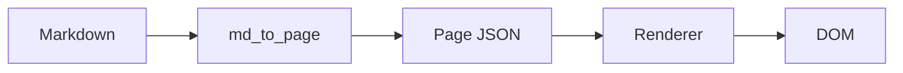

# Markdown demo

A page authored as plain Markdown. The kit converts it into the same
page-JSON shape used by hand-authored pages, so links, code, headings,
diagrams, and lists all render natively.

## Headings + paragraphs

Plain paragraphs with **bold**, *italic*, and `inline code`. Links
follow the standard form: [Apache Iceberg](https://iceberg.apache.org).

## Code blocks

Code fences become live `<pre>` blocks with the kit's line-number
gutter, fold gutter, copy + wrap buttons:

```python
def hello(name: str) -> None:
    print(f"hello, {name}")
```

A fenced `mermaid` block becomes a live diagram:



## Lists

- Unordered item one
- Unordered item two with `code` inline
- Unordered item three

1. Ordered item one
2. Ordered item two
3. Ordered item three

## Blockquote

> A blockquote becomes a callout. Useful for asides and warnings
> that aren't quite scary enough for the danger variant.

## Closing

That's the round-trip: write Markdown, run `html-doc build`, get the
same interactive page you'd get from authoring the JSON by hand.
