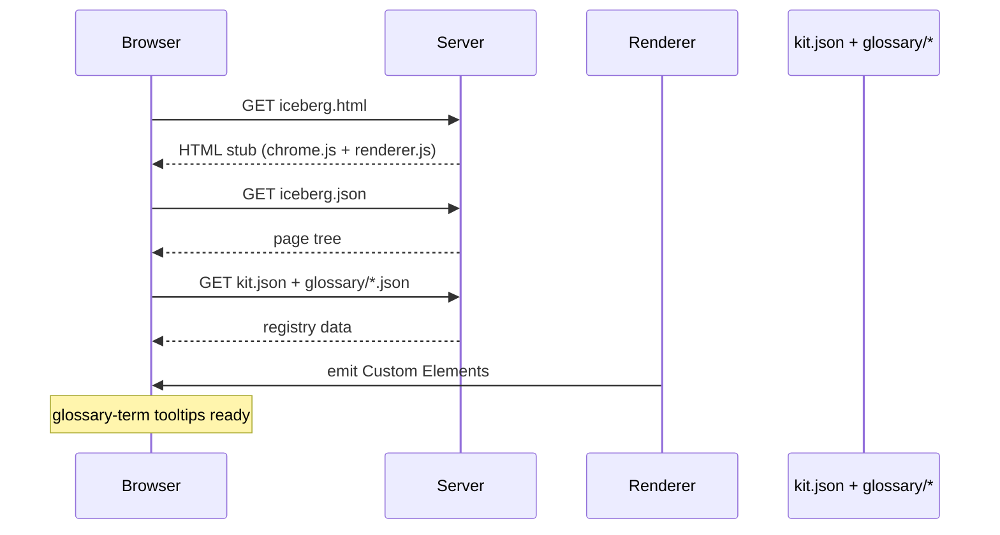
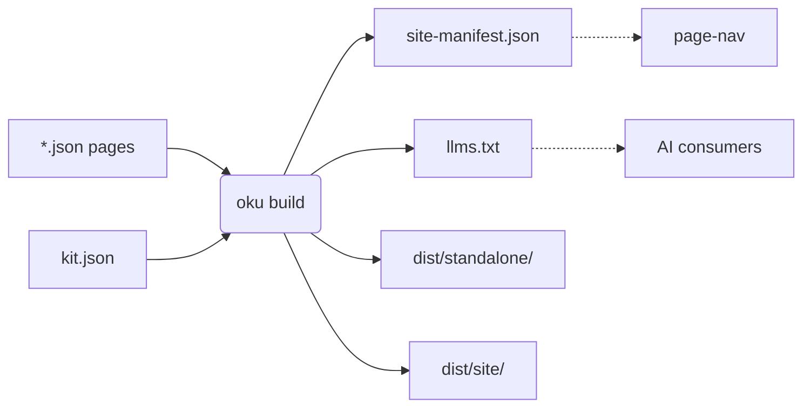

> [!TLDR]
> Three interactive primitives: data-driven SVG charts (scatter and line), Mermaid diagrams (lazy-loaded, theme-reactive), and editable HTML/CSS/JS snippets with iframe preview.
>
> - <chart> renders scatter and line plots from a series-of-points JSON shape. SVG-only, theme-aware.
> - <diagram> wraps Mermaid; loads the library on demand and re-renders on theme toggle.
> - <live-snippet> ships an editable textarea + sandboxed iframe preview. Type to see the preview update.

## Chart — scatter (cost vs. impact) {#scatter}

A 2-axis plot for evaluating items along two dimensions. Series of points with optional labels.

```oku-chart
{"type":"scatter","title":"Storage features — cost vs. impact","x_label":"Engineering cost","y_label":"User-visible impact","series":[{"label":"Shipped features","color":"success","data":[{"x":3,"y":8,"label":"JSON renderer"},{"x":2,"y":7,"label":"Glossary tooltips"},{"x":1,"y":5,"label":"Viewport fix"}]},{"label":"Polish","color":"accent","data":[{"x":4,"y":9,"label":"Site nav"},{"x":2,"y":4,"label":"Warning indicator"}]},{"label":"Future","color":"warn","data":[{"x":8,"y":7,"label":"Pagefind"},{"x":5,"y":6,"label":"Live snippets"}]}]}
```

## Chart — line (build progress) {#line}

Same primitive, line type. Tracks a metric over time.

```oku-chart
{"type":"line","title":"Build-step completion by round","x_label":"Round","y_label":"Steps complete","series":[{"label":"Cumulative complete","color":"accent","data":[{"x":1,"y":4},{"x":2,"y":8},{"x":3,"y":12}]},{"label":"Plan target","color":"muted","data":[{"x":1,"y":15},{"x":2,"y":15},{"x":3,"y":15}]}]}
```

## Diagram — Mermaid {#diagram}

Wrap any Mermaid source. The library is loaded lazily from a CDN on first use and cached for subsequent diagrams. Theme toggles trigger a re-render so dark/light tokens take effect.



*End-to-end request flow when a page loads.*



*Build outputs from oku build.*

## Live snippet — editable HTML/CSS/JS {#live-snippet}

Editable code on the left, sandboxed iframe preview on the right. Edit and watch the preview update with a small debounce.

```oku-live-snippet
{"src":"<style>\n  body {\n    margin: 0;\n    height: 100vh;\n    display: grid;\n    place-items: center;\n    background: linear-gradient(135deg, #0f766e, #2dd4bf);\n    font-family: system-ui, sans-serif;\n  }\n  .card {\n    background: white;\n    border-radius: 16px;\n    padding: 24px 32px;\n    box-shadow: 0 12px 36px rgba(0,0,0,0.15);\n    text-align: center;\n  }\n  .card h1 { margin: 0 0 8px; color: #115e59; font-size: 22px; }\n  .card p  { margin: 0; color: #475569; font-size: 14px; }\n</style>\n<div class=\"card\">\n  <h1>Hello, learner.</h1>\n  <p>Edit the source on the left — this preview updates live.</p>\n</div>","label":"Try changing the gradient and the message"}
```

```oku-live-snippet
{"src":"<style>\n  body { font: 14px/1.4 system-ui, sans-serif; padding: 16px; }\n  button { font: 14px system-ui; padding: 8px 14px; border-radius: 6px; border: 1px solid #ccc; cursor: pointer; background: #f5f5f5; }\n  button:hover { background: #eee; }\n  #count { font: 600 22px 'JetBrains Mono', monospace; margin-left: 12px; }\n</style>\n<button id=\"inc\">+1</button>\n<span id=\"count\">0</span>\n<script>\n  let n = 0;\n  document.getElementById('inc').addEventListener('click', () => {\n    document.getElementById('count').textContent = ++n;\n  });\n</script>","label":"Counter with state — proves JS runs in the iframe"}
```
